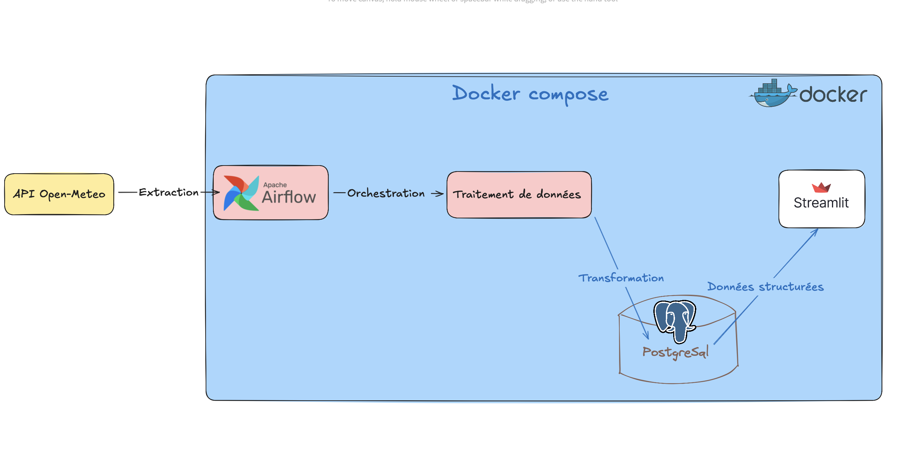
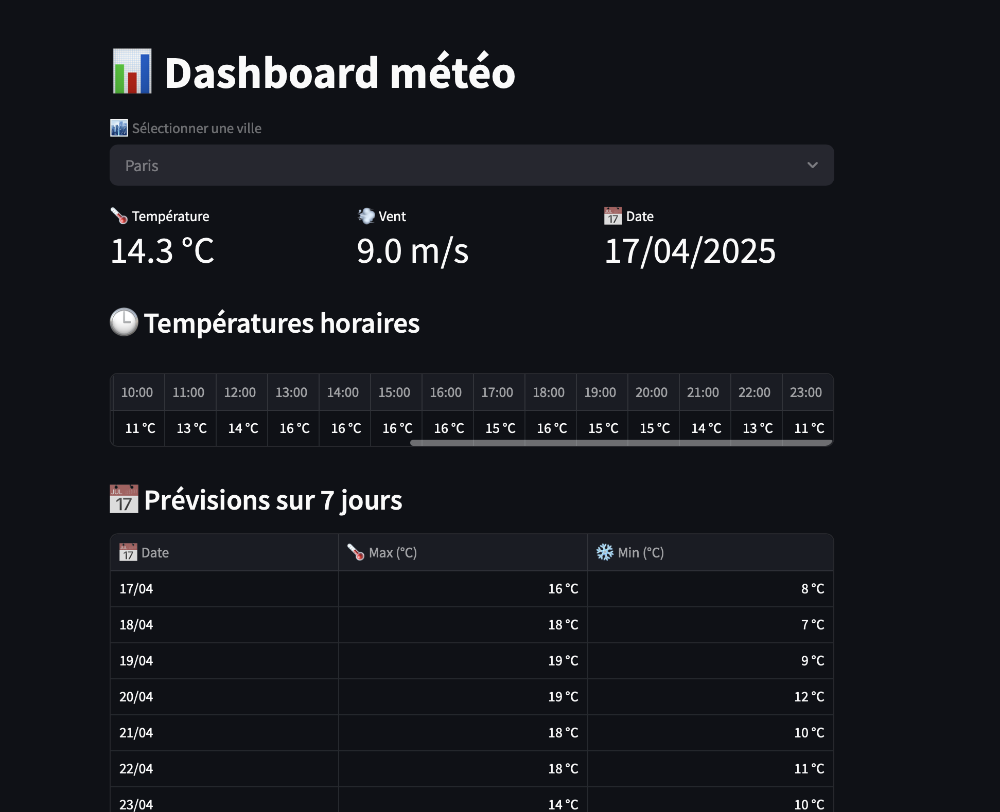

# 🌤️ Weather Data Pipeline (ETL + Dashboard)

Un projet complet de pipeline de données météo, orchestré avec Airflow, conteneurisé avec Docker, et visualisé avec Streamlit.

## 🚀 Objectif

Mettre en place un pipeline **ETL** de bout en bout :
- 🔄 Extraction des données depuis l'API Open-Meteo
- ⚙️ Transformation et nettoyage avec Python
- 🗃️ Chargement dans une base PostgreSQL
- 📊 Visualisation via un dashboard interactif Streamlit

## 🛠️ Technologies utilisées

- Python 3.10
- Apache Airflow
- PostgreSQL
- Docker & Docker Compose
- Streamlit
- SQLAlchemy / Pandas

## 📁 Architecture du projet
```bash
weather-data-pipeline/
├── airflow/           # Configuration Airflow
│   ├── Dockerfile     # Image Docker pour Airflow
│   └── requirements.txt  # Dépendances Airflow
├── dashboard/         # Application Streamlit
│   ├── Dockerfile     # Image Docker pour Streamlit
│   ├── dashboard.py   # Code du dashboard
│   └── requirements.txt  # Dépendances Streamlit
├── dags/              # DAGs Airflow
│   └── weather_dag.py # DAG de collecte de données météo
├── docker-compose.yml # Configuration des services
└── README.md          # Documentation
```
## Le workflow

<p align="center">
  
</p>

## 🐳 Lancer le projet avec Docker

```bash
# Construire et démarrer tous les services
docker-compose up --build 
```
## 🚀 Accéder à l'application

- 🔗 Airflow : http://localhost:8080
- 🔗 Dashboard Streamlit : http://localhost:8502

---
## 🖼️ Aperçu du Dashboard

Voici un aperçu du dashboard Streamlit affichant les données météo :
<p align="center">
  
</p>

---

## 📊 Résultat

- ✅ Données météo mises à jour automatiquement via **Airflow**
- ✅ Stockées dans **PostgreSQL**
- ✅ Affichées dans un **dashboard interactif** avec Streamlit

---

## 🙋‍♂️ Auteur

**Aboubacrine Seck**  
👨‍💻 Étudiant en Master Data & IA @ HETIC  
📧 [aboubacrineseckpro@gmail.com](mailto:aboubacrineseckpro@gmail.com)
